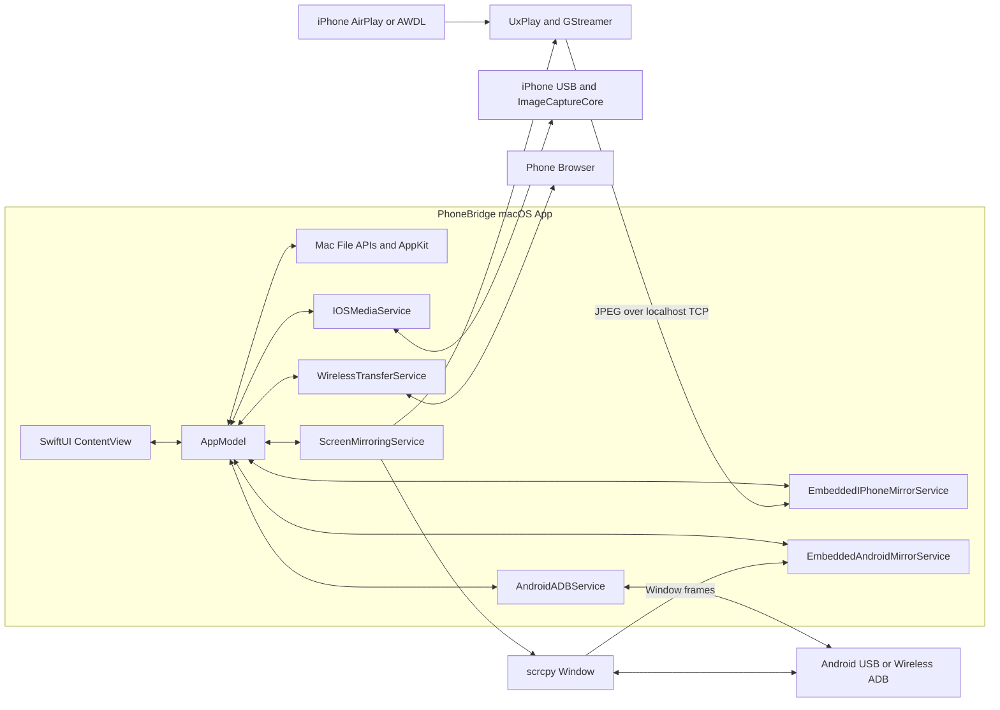
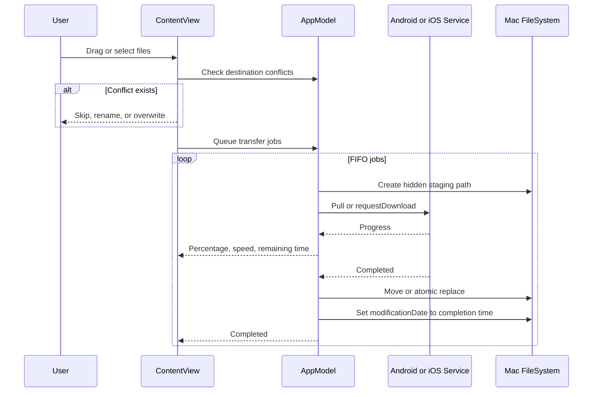
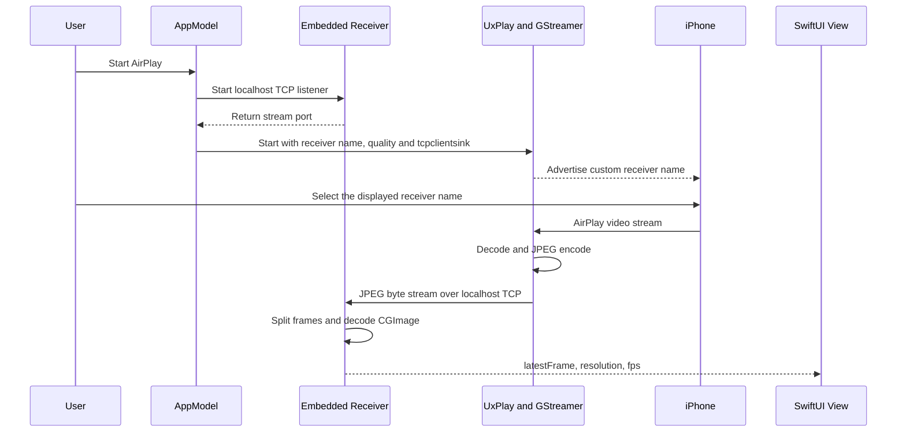

# PhoneBridge 技术方案与实现说明

> 适用版本：PhoneBridge 0.14.0（Build 24）
> 文档定位：架构设计、关键实现、构建发布、验证现状和后续演进
> 目标平台：Apple Silicon macOS 13+

## 1. 背景与目标

PhoneBridge 希望在一个 macOS 原生界面中打通以下能力：

- Android / iPhone 图片和视频浏览。
- 手机到 Mac 的批量传输。
- Mac 到 Android 的文件传输。
- Mac 到手机的本地文本/链接中转、剪贴板复制和系统分享。
- Mac 到 iPhone 的 Charles CA 证书分发。
- 多设备文件面板。
- Android 和 iPhone 投屏。
- 无数据线时的无线连接与文件上传。
- 可分发的自包含 DMG，不要求使用者预装 Homebrew 依赖。

方案优先使用系统公开框架和成熟开源组件，不使用越狱、iOS 私有文件系统接口或自定义手机端常驻 App。

## 2. 范围与非目标

### 2.1 当前范围

- Mac 本地文件浏览、打开、Finder 定位和移到废纸篓。
- Android USB/无线 ADB 设备发现、媒体浏览、双向文件传输。
- iPhone/iPad USB 媒体发现、缩略图和下载。
- 手机到 Mac 的拖拽、批量勾选、冲突策略和传输队列；Mac 文件可反向拖到手机面板。
- Android 上传目标目录选择与完整目标位置展示；iPhone 多文件一次性下载页。
- Mac/Android 可点击路径面包屑。
- 多台手机的独立文件面板与顺序调整。
- iPhone AirPlay 内嵌/独立窗口双模式及三档画质，无 USB 设备发现也可启动接收器。
- AirPlay 接收名称自定义、持久化与运行中热切换。
- Android scrcpy 内嵌只查看 / 独立可控制双模式投屏。
- 本地 HTTP 无线上传、文件下载和证书二维码。
- Apple Silicon 自包含 DMG。

### 2.2 当前非目标

- 完整 iOS 文件系统管理。
- 通过 iOS USB 照片接口写入任意文件。
- Android 内嵌投屏中的键鼠反向控制。
- 同时内嵌多路 iPhone 投屏。
- iPhone 投屏音频。
- 云端中转、跨公网传输或账号系统。
- Windows、Linux 和 Intel Mac 发布包。
- Apple Developer ID 签名与公证。

## 3. 技术选型

| 领域 | 技术 | 选型原因 |
| --- | --- | --- |
| 桌面 UI | SwiftUI + AppKit | 原生 macOS 体验；AppKit 补充拖拽、文件选择和系统操作 |
| 状态管理 | `ObservableObject`、`@Published`、`@MainActor` | 与 SwiftUI 数据流直接结合，保证 UI 状态在主线程更新 |
| Android 设备与文件 | ADB | 官方调试通道，USB/无线连接可复用同一套命令 |
| Android 投屏 | scrcpy + ScreenCaptureKit | scrcpy 负责取流解码；ScreenCaptureKit 按窗口捕获后嵌入 SwiftUI，同时保留独立可控制模式 |
| iOS 媒体 | ImageCaptureCore | macOS 系统公开框架，可读取已信任 iPhone 的照片和视频 |
| iPhone 投屏接收 | UxPlay + GStreamer | 不依赖 Apple ID、QuickTime 或系统 iPhone 镜像功能 |
| 内嵌帧通道 | Network.framework + JPEG + ImageIO | 实现成本低，可把 UxPlay 输出直接接入 SwiftUI |
| 无线文件传输 | Network.framework 自建轻量 HTTP 服务 | 无需手机端安装 App，浏览器即可上传/下载 |
| 二维码 | CoreImage `CIQRCodeGenerator` | 系统原生生成二维码，无额外依赖 |
| 构建 | Swift Package Manager | 项目轻量，命令行和 Xcode 均可构建 |
| 发布 | shell、`install_name_tool`、`codesign`、`hdiutil` | 将第三方依赖封装并生成可分发 DMG |

## 4. 总体架构



`AppModel` 是应用编排中心：聚合设备、维护每台设备的列表状态、调度文件传输、启动投屏、持久化配置，并把服务层事件转换为界面状态。

## 5. 代码结构

| 文件 | 职责 |
| --- | --- |
| `PhoneBridgeApp.swift` | App 入口、`AppModel` 生命周期、`Command + R` 刷新命令 |
| `ContentView.swift` | 主界面、多设备面板、筛选排序、拖拽、任务栏、投屏侧栏 |
| `Models.swift` | 平台、设备、远端文件、传输状态和画质档位数据模型 |
| `AppModel.swift` | 业务编排、状态持久化、传输队列、设备排序和服务协调 |
| `AndroidADBService.swift` | ADB 发现、目录解析、pull、push、pair/connect/disconnect |
| `IOSMediaService.swift` | ImageCaptureCore 设备发现、媒体目录、缩略图和下载 |
| `ScreenMirroringService.swift` | scrcpy 和 UxPlay 子进程管理、运行环境和错误收集 |
| `EmbeddedAndroidMirrorService.swift` | 定位 scrcpy 进程的唯一窗口，通过 ScreenCaptureKit 读取画面并统计 fps |
| `EmbeddedAndroidMirrorView.swift` | Android 内嵌画面、等待/失败状态的 SwiftUI 展示 |
| `EmbeddedIPhoneMirrorService.swift` | 本地 TCP 监听、JPEG 流切帧、图像解码、fps 统计 |
| `EmbeddedIPhoneMirrorView.swift` | iPhone 内嵌画面的 SwiftUI 展示 |
| `WirelessTransferService.swift` | 本地 HTTP 服务、随机令牌、上传、下载和文件落盘 |
| `WirelessTransferView.swift` | 二维码、共享文件、证书引导和本次接收列表 |
| `TextTransferView.swift` | 文本输入、一次性页面、Android 自动打开和 iPhone 二维码接收 |
| `WirelessConnectionView.swift` | Android 无线 ADB、iPhone 附近投屏配置 |
| `DragCodec.swift` | `RemoteEntry` 的拖拽 JSON 编码/解码 |
| `MacDropReceiver.swift` | AppKit 原生拖拽接收层，解决 SwiftUI 空白区接收问题 |
| `CommandRunner.swift` | 异步启动命令行进程并收集标准输出和错误输出 |

## 6. 核心数据模型

### 6.1 设备模型

`PhoneDevice` 统一描述 Android 与 iOS：

```swift
struct PhoneDevice: Identifiable, Hashable {
    let id: String
    let name: String
    let platform: PhonePlatform
    let detail: String
}
```

- Android `id` 使用 ADB serial；无线 ADB 时通常为 `IP:端口`。
- iOS `id` 使用 ImageCaptureCore 设备 UUID。
- 同一个 `id` 同时用于面板状态、传输路由和投屏选择。

### 6.2 远端文件模型

`RemoteEntry` 把 Android 路径项和 iOS 媒体统一为：

- 设备 ID。
- 平台。
- 文件名和远端标识。
- 目录、图片或视频类型。
- 文件大小和修改/创建时间。

iOS 的 `remotePath` 是媒体名，不代表可浏览的真实 DCIM 路径；真正下载依赖内存中的 `ICCameraFile` 映射。

### 6.3 传输模型

`TransferJob` 包含：

- 任务 ID。
- 源文件名。
- 目标 URL。
- 总字节数。
- 进度。
- 状态。
- 开始时间。
- 预计剩余时间。
- 当前速度。

状态为：等待、运行、完成、失败。失败状态保留错误文本和重试载荷。

## 7. UI 与多设备面板实现

### 7.1 布局

主界面使用动态 `HSplitView`：

```text
Mac 面板 | 设备 1 | 设备 2 | ... | 可选投屏侧栏
```

特点：

- 分隔线可调整每个面板宽度。
- 没有设备时显示等待连接的空状态。
- `isMirrorSidebarVisible` 初始值为 `false`，因此投屏栏默认隐藏。
- 进入专注投屏时暂时只显示投屏区。

### 7.2 每设备独立状态

`AppModel` 维护：

- `remoteEntriesByDeviceID`
- `remotePathsByDeviceID`
- `refreshingDeviceIDs`

`ContentView` 维护：

- `selectedRemoteIDsByDevice`
- `remoteSortByDevice`
- `remoteSearchByDevice`
- `remoteKindFilterByDevice`

因此刷新、搜索或勾选一台手机不会污染其他设备面板。

### 7.3 连接顺序与拖动排序

`deviceConnectionOrder` 保存当前连接设备的顺序：

1. 合并 ADB 和 ImageCaptureCore 的发现结果。
2. 删除已经断开的设备 ID。
3. 把新发现 ID 追加到末尾。
4. 根据该数组重建 `devices`。

用户拖动面板标题时，`DevicePanelDropDelegate` 调用 `moveDevicePanel` 修改顺序。该顺序当前只保存在本次运行内，重启后按重新发现顺序建立。

## 8. Mac 文件能力

Mac 文件读取使用 `FileManager.contentsOfDirectory`，读取：

- 是否为目录。
- 文件大小。
- 修改时间。
- 隐藏属性。

当前会跳过隐藏文件和包内容。

系统交互通过 AppKit：

- `NSOpenPanel` 选择目录或文件。
- `NSWorkspace.open` 使用默认应用打开文件。
- `NSWorkspace.activateFileViewerSelecting` 在 Finder 中定位。
- `NSWorkspace.recycle` 移到系统废纸篓。
- `NSPasteboard` 写入/读取 Finder 兼容的文件 URL，实现文件“拷贝”和空白区“粘贴项目”。
- `FileManager.createDirectory` 与 `createFile` 实现空白区新建文件夹/空文件。

粘贴项目不覆盖同名文件：按“`名称 副本`”“`名称 副本 2`”递增生成目标路径。目录不能粘贴到自身或自身的子目录，避免递归复制。

最后访问目录存入 `UserDefaults`，键为：

```text
PhoneBridge.lastLocalDirectory
```

## 9. Android 文件方案

### 9.1 ADB 定位

运行时按以下顺序查找 ADB：

1. App `Contents/Resources/adb`。
2. `/opt/homebrew/bin/adb`。
3. `/usr/local/bin/adb`。
4. `~/Library/Android/sdk/platform-tools/adb`。
5. `/Library/Android/sdk/platform-tools/adb`。

发布版优先使用随 App 内置的 ADB。

### 9.2 设备发现

执行：

```bash
adb devices -l
```

只接受状态为 `device` 的行，过滤 `offline` 和 `unauthorized`。设备名优先使用 `model`，详情使用 `product`。

### 9.3 目录读取

通过 `adb -s <serial> shell` 执行 shell 脚本，对普通文件和隐藏文件调用：

```bash
stat -c '%F|%s|%Y|%n'
```

解析后只保留：

- 目录。
- 允许扩展名集合中的图片。
- 允许扩展名集合中的视频。

远端路径使用单引号转义，降低空格和特殊字符导致命令解析错误的风险。

当筛选切换为照片或视频时，`AndroidMediaScope` 进入虚拟媒体库模式，递归扫描 `DCIM`、`Pictures`、`Movies` 和 `Download`。远端命令先按扩展名过滤，再使用 `find -print0 | xargs -0 stat` 批量读取元数据，并排除隐藏目录和解包 APK 资源。

### 9.4 Android 缩略图

`AndroidADBService.thumbnailData` 按需把单个媒体拉取到临时目录：

- 图片通过 ImageIO 生成缩略图。
- 视频通过 `AVAssetImageGenerator` 在约 0.2 秒处抽帧。
- 同时最多两个缩略图任务，生成后立即删除临时原文件。
- 超过 1GB 的视频跳过缩略图，避免为预览导入过大数据。

### 9.5 Android 到 Mac

使用：

```bash
adb -s <serial> pull <remote> <staging>
```

ADB pull 本身的进度输出不稳定，因此实现通过每 200ms 读取 Mac 临时文件大小，除以预期总大小计算进度，完成前最多显示 98%。

### 9.6 Mac 到 Android

目标目录由文件选择器附件中的 `NSComboBox` 提供。默认使用当前 Android 浏览目录；媒体自动扫描页回退到 `/sdcard/Download/PhoneBridge`。先创建用户选择的目录：

```bash
adb -s <serial> shell mkdir -p <remoteDirectory>
```

再执行：

```bash
adb -s <serial> push <local> <remoteDirectory>/<filename>
```

传输期间每 250ms 在 Android 上执行 `stat -c %s` 获取目标文件大小，用于估算进度。

### 9.7 Android 无线连接

界面分别调用：

```bash
adb pair <IP:配对端口> <6位配对码>
adb connect <IP:连接端口>
adb disconnect <IP:连接端口>
```

配对成功不等于已建立可用设备连接，因此 UI 把“配对”和“连接”分成两个步骤。连接成功后重新刷新设备列表，后续浏览、pull、push 和 scrcpy 都通过 serial 复用无线通道。

## 10. iOS 媒体方案

### 10.1 设备发现

`IOSMediaService` 使用：

- `ICDeviceBrowser`
- 浏览类型 `.camera`
- `ICCameraDeviceDelegate`

发现设备后只接受产品类型包含 iPhone、iPad 或 iPod 的 Apple 移动设备，并请求打开相机会话。

“刷新设备”除了刷新已有会话，还会在没有设备时停止并重启浏览器，处理应用重启后偶发未收到首次回调的情况。

### 10.2 媒体目录

从 `camera.mediaFiles` 中读取 `ICCameraFile`：

- UTI 符合 `UTType.image` 时标记为图片。
- UTI 符合 `UTType.movie` 时标记为视频。
- 默认按创建日期倒序。

内存中维护：

```text
RemoteEntry ID -> ICCameraFile
```

断开设备时清理该设备对应的条目和映射。

### 10.3 缩略图

通过 `requestThumbnailData` 请求最大 180 像素的系统缩略图。

控制策略：

- 同时最多 3 个 ImageCaptureCore 缩略图请求。
- AppModel 使用 `NSCache`。
- 最大条目数 600。
- 总成本限制 64MB。
- 相同条目的并发请求合并为同一个 Task。

### 10.4 下载

通过 `ICCameraFile.requestDownload` 下载到 Mac 临时目录，配置：

- 不覆盖。
- 下载后不删除手机原文件。
- 不下载 sidecar 文件。

`Progress.fractionCompleted` 用于更新进度。

### 10.5 iOS 写入限制

ImageCaptureCore 在本方案中只承担媒体读取，不能作为任意文件写入接口。PhoneBridge 因此没有实现“USB 把任意文件推入 iPhone 文件系统”。

当前 Mac→iPhone 方案集中在本地网页下载，重点支持 Charles 证书文件。

## 11. 手机到 Mac 的传输引擎

### 11.1 流程



### 11.2 队列

手机到 Mac 使用单独 FIFO 队列串行执行。串行策略减少：

- 同一 USB 通道被多个大文件竞争。
- iOS ImageCaptureCore 并发下载不稳定。
- 同一目标目录同名文件竞争。

Mac 到 Android 使用另一个串行上传队列，因此两个方向的队列彼此独立。

文件成功提交到 Mac 后，通过 `FileManager.setAttributes([.modificationDate: Date()])` 把文件系统修改时间设为完成时间。该逻辑同时用于 Android/iOS USB 下载和无线 HTTP 上传，不解析也不改写 EXIF 或容器内部时间。

### 11.3 临时文件和提交

真实目标为：

```text
目标目录/文件名.ext
```

传输阶段先写入：

```text
目标目录/.phonebridge-<UUID>.part.ext
```

成功后：

- 非覆盖：`moveItem` 移动到正式文件名。
- 覆盖：`replaceItemAt` 替换原文件。

失败时删除 staging 文件。这保证任务完成前不会出现一个看似正常但内容不完整的目标文件。

### 11.4 冲突策略

- 跳过：不创建任务。
- 自动重命名：尝试 `name (1).ext`、`name (2).ext`。
- 覆盖：只覆盖普通文件；如果同名目标是目录，则自动改名。

队列创建时使用大小写不敏感的标准化目标路径集合，避免同一批次内部两个文件占用同一目标名。

### 11.5 进度、速度和剩余时间

任务运行超过 0.5 秒且进度位于 0 到 1 之间时：

```text
速度 = 总字节数 × 当前进度 / 已用时间
剩余时间 = 总字节数 × (1 - 当前进度) / 速度
```

这是平均速度估算，短文件或速度波动时会有误差。

### 11.6 失败重试

任务创建时保留 `PendingTransfer` 或 `PendingUpload`；Android 上传载荷同时保留 `remoteDirectory`，保证重试仍写入原目标。失败后重试：

- 复用原任务 ID 和目标。
- 清空旧进度、开始时间、速度和剩余时间。
- 重新加入对应队列。

## 12. 拖拽方案

`RemoteEntry` 遵循 `Codable`，手机到 Mac 拖动时编码为 JSON 数据，通过系统 `UTType.data` 传递。Mac 到手机使用标准 `UTType.fileURL`，`LocalFileDragCodec` 异步解析并去重本地 URL。

Mac 面板由 `MacDropReceiver` 这个 AppKit `NSView` 容器承载，内部再放入 `NSHostingView` 显示 SwiftUI 内容。接收器是整个左侧面板所有子视图的共同父级，因此 AppKit 会沿视图层级把文件行、列表空白区、路径区和底部区域中的拖拽统一交给同一个目标。

旧实现同时在文件行、滚动区和空白区注册多个 `.onDrop`，快速跨过边界时会反复退出/进入热区，产生高亮闪烁甚至未提交。当前实现删除行级竞争目标，只保留单一原生父级接收器；退出高亮另有 160ms 防抖。拖到左侧任意位置都保存到当前 Mac 目录。

拖拽载荷只在 PhoneBridge 当前拖拽会话中使用，不写入磁盘，也不暴露自定义导出 UTI。

手机面板通过单个 `PhonePanelDropDelegate` 同时区分两类载荷：`UTType.text` 用于设备面板排序，`UTType.fileURL` 用于文件传输。Android 把文件加入当前目录的 ADB push 队列；iPhone 启动一次性 HTTP 下载页，由 iOS 在下载/分享界面选择实际保存目录。

## 13. 无线传输方案

### 13.1 服务启动

`WirelessTransferService` 使用 `NWListener(using: .tcp)`，让系统分配空闲端口，避免固定端口冲突。

启动时：

1. 生成 32 位十六进制风格随机令牌。
2. 查找已启用、非 loopback 的本地 IPv4 地址。
3. 排除 `utun`、`awdl`、`llw` 等不适合作为浏览器入口的接口。
4. 生成访问地址：

```text
http://<Mac局域网IP>:<随机端口>/<一次性令牌>/
```

### 13.2 HTTP 路由

| 方法 | 路由 | 作用 |
| --- | --- | --- |
| GET | `/令牌/` | 返回手机端上传/下载页面 |
| GET | `/令牌/download` | 下载当前共享文件 |
| POST | `/令牌/upload?name=文件名` | 手机上传文件到 Mac |

错误令牌和未知路由返回 404。

### 13.3 上传

- HTTP 头最大缓存 64KB。
- 请求必须包含 `Content-Length` 和文件名。
- 文件名会取 `lastPathComponent` 并替换危险分隔符。
- 上传正文按最大 1MB 数据块接收。
- 对 `Expect: 100-continue` 请求先返回 `HTTP/1.1 100 Continue`，兼容 iOS/CFNetwork 的大文件上传握手。
- 上传期间由 receive 回调强持有连接上下文，直到完整接收、失败或取消，避免图片/视频分段上传时上下文提前释放。
- 先写隐藏临时文件，接收完整后再移动为正式文件。
- 同名文件自动重命名，不覆盖。
- 完成后触发 Mac 文件区刷新。

### 13.4 下载

共享文件按 512KB 分块发送，响应包含：

- MIME 类型。
- `Content-Length`。
- UTF-8 文件名的 `Content-Disposition`。

Charles 证书根据扩展名返回对应 MIME 类型。

### 13.5 文本与链接传输

`TextTransferView` 把 Mac 输入内容交给同一个 `WirelessTransferService`，网页按需渲染：

- 只读文本框。
- “复制文本”：安全上下文优先使用 Clipboard API，普通局域网 HTTP 回退到用户手势触发的 `execCommand('copy')`。
- “分享到备忘录 / 其他 App”：调用 Web Share API，由 Android/iOS 系统分享面板选择目标。
- “打开链接”：仅当完整内容可解析为带主机的 HTTP/HTTPS URL 时显示。

Android ADB 场景会先执行 `adb reverse tcp:<端口> tcp:<端口>`，再用 `am start` 打开 `http://127.0.0.1:<端口>/<令牌>/`，因此 USB 连接不依赖手机和 Mac 在同一 Wi-Fi。没有可用局域网 IPv4 时，服务允许为 Android 文本场景生成 loopback 地址。关闭文本窗口会移除 reverse 并停止服务。

iPhone 没有等价的公开 USB 端口转发能力，因此显示局域网二维码。浏览器安全模型不允许 Mac 静默写入手机剪贴板或直接创建备忘录，必须由用户在页面上点击复制或分享。

### 13.6 二维码与生命周期

二维码由 CoreImage 生成，纠错等级为 M。

关闭无线传输窗口会调用 `stop()`：

- 取消 listener。
- 清空访问 URL。
- 原令牌对应地址不再可访问。

### 13.7 安全边界

当前是局域网 HTTP，不是 HTTPS，也没有账号认证。安全措施为：

- 高熵随机路径令牌。
- 不展示无令牌的固定入口。
- 关闭窗口立即停止服务。
- 不经过云端。
- 文件名净化和同名自动改名。
- 页面响应使用 `Cache-Control: no-store`。

这适合个人受信任局域网，不应直接暴露到公网。随机令牌不能替代 TLS 和完整身份认证。

## 14. Charles CA 分发

用户选择 `.cer`、`.crt`、`.pem` 或 `.mobileconfig` 后：

1. 以当前 Mac 目录作为手机上传接收目录。
2. 以所选证书作为 HTTP 下载文件。
3. 启动无线传输服务。
4. 展示二维码和 iOS 安装步骤。
5. 提供 `chls.pro/ssl` 备用入口。

PhoneBridge 只负责分发，不会绕过 iOS 的描述文件安装和证书完全信任确认。

## 15. Android 投屏方案

每台 Android 使用独立 `Process`，并支持两种 `AndroidMirrorMode`：

- `embedded`：最右侧内嵌只查看。
- `separateWindow`：scrcpy 独立可控制窗口。

独立模式执行：

```bash
scrcpy \
  --serial <deviceID> \
  --window-title "PhoneBridge · <deviceName>" \
  --stay-awake
```

`scrcpyProcesses` 以设备 ID 为键，因此：

- 同一设备只启动一个窗口。
- 多台 Android 可各自运行窗口。
- USB 和无线 ADB 使用相同设备 ID 路由。
- 切换显示模式时先停止当前 scrcpy，由用户重新开始目标模式。

内嵌模式为 scrcpy 设置唯一窗口标题和 360×640 初始尺寸。`EmbeddedAndroidMirrorService` 通过 `SCShareableContent` 按 PID 和标题定位 `SCWindow`，用 `SCContentFilter(desktopIndependentWindow:)` 建立 30fps 捕获，再把 BGRA 像素帧转为 `CGImage` 交给 SwiftUI。首帧超时或 `SCStream` 中断时最多自动重建 5 次画面通道；scrcpy 进程异常退出时，`AppModel` 最多自动重启 3 次，并在稳定运行 15 秒后清零计数。

这一嵌入方式不向 scrcpy 反向注入键鼠事件，因此内嵌是只查看模式。需要控制、剪贴板和拖放时使用独立窗口。

## 16. iPhone 投屏方案

### 16.1 端到端流程

无线连接页可直接调用 `startIPhoneMirroring(allowWithoutConnectedDevice: true)`，因此 AirPlay 广播不再依赖 ImageCaptureCore 先发现 USB iPhone。普通模式使用局域网 Bonjour；附近模式向 UxPlay 追加 `-p2p -pin <PIN>`，通过 macOS Apple DNS-SD/AWDL 广播。



独立窗口模式跳过本地 TCP/JPEG 接收器，并显式传入 `-vs avsamplebufferlayersink`。安装包中的 macOS AVSampleBuffer 视频输出组件注册优先级为 `none`，默认 `autovideosink` 无法稳定自动选择；显式指定后由 UxPlay/GStreamer 创建渲染窗口，并在检测到视频流启动日志后将窗口带到前台。内嵌模式继续使用上图链路。

### 16.2 UxPlay 参数

接收名称来自 `AppModel.iPhoneAirPlayName`，默认值为 `PhoneBridge`。普通局域网和附近设备模式使用同一名称，并通过 UxPlay 的 `-n` 参数发布。

关键参数：

```text
-n <receiverName>   发布到 iPhone“屏幕镜像”列表的接收名称
-nh                 AirPlay 名称末尾不追加 Mac 主机名
-as 0               关闭音频输出
-vsync no           不做 UxPlay 侧垂直同步
-s <resolution>     请求视频分辨率
-fps <fps>          最大帧率
-vs <pipeline>      自定义 GStreamer 视频输出管线
```

附近模式追加：

```text
-p2p
-pin <4位PIN>
```

### 16.3 画质配置

| 档位 | UxPlay 分辨率请求 | 最大 fps | JPEG quality |
| --- | --- | --- | --- |
| 清晰优先 | `1920x1080@60` | 30 | 97 |
| 流畅优先 | `1920x1080@60` | 60 | 92 |
| 节省带宽 | `1280x720@60` | 30 | 86 |

`@60` 是 UxPlay 的分辨率模式字符串；实际最大输出仍由独立 `-fps` 控制。

### 16.4 内嵌帧管线

GStreamer 输出：

```text
jpegenc quality=<quality> ! tcpclientsink host=127.0.0.1 port=<port>
```

`EmbeddedIPhoneMirrorService` 在 `50000...59000` 中随机选择端口并启动 `NWListener`。

接收后：

1. 累积 TCP 字节流。
2. 按 JPEG SOI `FF D8` 和 EOI `FF D9` 切帧。
3. 缓冲超过 20MB 且无法形成完整帧时清空，避免无限增长。
4. 使用 ImageIO 解码为 `CGImage`。
5. 发布 `latestFrame`、像素尺寸和实测 fps。
6. SwiftUI 使用高质量插值和 `scaledToFit` 显示。

### 16.5 当前性能边界

当前链路为：

```text
AirPlay -> GStreamer 解码 -> JPEG 编码 -> TCP -> ImageIO JPEG 解码 -> SwiftUI
```

优点是实现简单、隔离清晰、容易嵌入；缺点是 JPEG 重编码会增加：

- CPU 使用。
- 本机内存带宽。
- 高帧率时的数据量。
- 与 H.264 直解相比的画质损失。

后续可评估 GStreamer appsink、IOSurface、CVPixelBuffer 或 VideoToolbox 直通方案。

### 16.6 并发限制

- UxPlay 只维护一个活动进程，因此同一时间只支持一路 iPhone 投屏（内嵌或独立）。
- 切换选中设备时会停止当前活动投屏。
- Android scrcpy 进程按设备分离，不受该限制。

### 16.7 接收名称配置

- 无线连接页把 iPhone 名称、显示方式、AWDL/PIN 和启动按钮集中放在第一个 GroupBox；点击“保存名称”或按回车后提交。
- 名称会合并空白字符，空值回退为 `PhoneBridge`，并按完整 Unicode 字符截断到最多 48 个 UTF-8 字节。
- `AppModel` 写入 `UserDefaults`，下次启动恢复。
- 投屏运行中改名时，先停止当前 UxPlay，再以新 `-n` 参数自动启动；iPhone 需要重新选择接收器。
- 投屏侧栏直接显示生效后的名称，便于多人环境现场核对。

### 16.8 投屏截屏与录屏

`MirrorCaptureService` 将四种投屏组合统一为 `MirrorCaptureSource`：

- iPhone / Android 内嵌模式直接读取对应服务的最新 `CGImage`，避免重复采集。
- iPhone / Android 独立窗口根据 UxPlay 或 scrcpy 的进程 ID，通过 `SCShareableContent` 找到面积最大的投屏窗口，再用 `SCStream` 持续接收窗口帧。

截屏使用 `NSBitmapImageRep` 输出 PNG。录屏使用 `AVAssetWriter`、`AVAssetWriterInputPixelBufferAdaptor` 和 H.264 编码；按原始宽高比缩放到最长边不超过 1920 像素的偶数尺寸，空余区域使用黑色填充，时间戳采用实际录制时长而非固定帧序号。

录制先写入系统临时目录，结束并成功封装 MP4 后再弹出文件夹选择器。用户取消选择时保留临时文件，并在工具栏显示“保存录像”；成功移动到目标目录后才清除待保存状态。独立窗口采集需要 macOS 屏幕录制权限，内嵌帧保存不额外申请权限。

## 17. 配置持久化

使用 `UserDefaults` 保存：

| Key | 内容 |
| --- | --- |
| `PhoneBridge.lastLocalDirectory` | 最后访问的 Mac 目录 |
| `PhoneBridge.iPhoneMirrorQuality` | iPhone 投屏画质档位 |
| `PhoneBridge.iPhoneAirPlayName` | 自定义 AirPlay 接收名称 |
| `PhoneBridge.iPhonePeerToPeer` | 是否启用附近设备模式 |
| `PhoneBridge.iPhonePeerToPeerPIN` | 4 位附近投屏 PIN |
| `PhoneBridge.iPhoneMirrorMode` | iPhone 投屏的内嵌 / 独立窗口偏好 |
| `PhoneBridge.androidMirrorMode` | Android 投屏的内嵌 / 独立窗口偏好 |
| `PhoneBridge.lastMirrorCaptureDirectory` | 上次投屏截图或录像的保存文件夹 |

设备面板顺序、搜索、筛选、排序和勾选状态当前不跨应用重启保存。

## 18. 并发与线程模型

- `AppModel`、`IOSMediaService`、`WirelessTransferService` 标记为 `@MainActor`，UI 状态集中在主线程更新。
- ADB 命令通过 `ProcessRunner` 异步执行。
- `ProcessRunner` 使用带锁 `DataBuffer` 并发收集 stdout/stderr。
- iPhone JPEG 接收使用独立串行 `frameQueue`。
- 无线 HTTP 服务使用独立 `serverQueue`。
- 回调需要更新 UI 时切回主线程。
- 文件传输队列由 Task 串行消费，避免同方向任务无控制并发。

## 19. 错误处理与可观测性

### 19.1 用户可见状态

- `statusMessage`：底部单行状态。
- `errorMessage`：弹窗错误。
- `TransferJob.state`：每个传输任务状态。
- iPhone 投屏状态机：idle、启动 AirPlay、启动本地接收、等待手机、运行、失败。

### 19.2 子进程错误

- ADB 使用退出码、stderr、stdout 组合生成错误信息。
- scrcpy 非零退出码提示检查 USB 调试授权。
- UxPlay 保留最近 20 行日志，异常退出时带最近 3 行摘要。

### 19.3 已知不足

- 没有持久化日志文件和日志级别。
- 没有统一结构化事件 ID。
- 无线 HTTP 没有请求审计记录。
- 第三方进程 stdout/stderr 仅做有限错误摘要。

后续可增加本地滚动日志并提供“一键导出诊断包”。

## 20. 构建与发布

### 20.1 SwiftPM 构建

项目最低平台为 macOS 13，链接：

- AppKit
- CoreImage
- ImageCaptureCore
- Network
- SwiftUI
- UniformTypeIdentifiers

构建：

```bash
./scripts/build_app.sh
```

脚本流程：

1. 生成 `.icns`。
2. 使用完整 Xcode 或指定 macOS 15.4 SDK 执行 Release 构建。
3. 创建 `dist/PhoneBridge.app`。
4. 复制 Info.plist 和图标。
5. 执行临时签名。

### 20.2 图标生成

`generate_icon.sh` 从 `Resources/AppIcon-1024.png` 生成 16 到 1024 像素的 iconset，再由 `build_icns.py` 生成 `PhoneBridge.icns`。

### 20.3 第三方依赖封装

`bundle_dependencies.sh`：

1. 复制 UxPlay、scrcpy、ADB、scrcpy-server。
2. 复制 GStreamer plugin scanner 和必要插件，包括 UxPlay 启动检查所需的 `libav` 与 `autodetect`。
3. 递归分析所有 Mach-O 的 `otool -L` 依赖。
4. 把 Homebrew 动态库复制到 `Contents/Frameworks`。
5. 使用 `install_name_tool` 改写为 `@loader_path` 相对路径。
6. 设置 GStreamer、scrcpy 运行时环境变量。
7. 写入第三方许可证和 UxPlay 源码包。
8. 对所有 Mach-O 和 App 重新签名。
9. 检查是否残留 `/opt/homebrew` 或 `/usr/local` 动态加载路径。
10. 执行 `codesign --verify --deep --strict`。

### 20.4 DMG

执行：

```bash
./scripts/package_dmg.sh
```

生成：

```text
dist/PhoneBridge-0.14.0-AppleSilicon.dmg
```

DMG 包含：

- `PhoneBridge.app`
- 指向 `/Applications` 的快捷方式
- 中文安装说明

脚本使用 `hdiutil create` 创建压缩 UDZO 镜像，并自动执行 `hdiutil verify` 和 SHA-256 计算。

### 20.5 签名与公证

当前为 ad-hoc 临时签名：

```text
Identifier=com.personal.phonebridge
TeamIdentifier=not set
```

适合个人使用和受控分享。面向大范围分发时应：

1. 使用 Apple Developer ID Application 签名。
2. 提交 Apple Notary Service 公证。
3. 对公证结果执行 stapling。
4. 验证 Gatekeeper 安装体验。

## 21. 安全与隐私

### 21.1 数据路径

- USB 传输发生在手机与 Mac 之间。
- 无线传输发生在手机浏览器与 Mac 本地 HTTP 服务之间。
- 应用不包含云端服务，不主动上传文件到互联网。

### 21.2 文件安全

- 手机到 Mac 先写临时文件，成功后提交。
- 覆盖采用完成后替换。
- 无线同名文件自动重命名。
- 本地删除使用系统废纸篓。
- iOS 下载不删除手机原文件。

### 21.3 命令安全

- ADB 大部分参数通过 `Process.arguments` 传入，不经过本机 shell。
- Android 远端 shell 路径使用单引号转义。
- 无线文件名取 basename 并替换 `/`、`:`。

### 21.4 证书风险

Charles CA 可以解密受信任设备上的 HTTPS 流量。PhoneBridge 只提供分发和安装说明，不应自动开启信任。使用者应在完成测试后关闭代理，并按安全要求撤销信任或删除证书。

## 22. 验证状态

### 22.1 已完成验证

- PhoneBridge 0.14.0 Release 编译通过，无 Swift 编译警告。
- 主程序为 arm64 Mach-O。
- DMG 创建、CRC 校验和只读挂载通过。
- DMG 内 App 版本为 0.14.0，Build 24。
- DMG 内 App 深度签名校验通过。
- UxPlay、GStreamer、scrcpy、ADB 已封装。
- UxPlay 启动检查所需的 `libav`、`autodetect` 插件及递归动态库已封装；使用包内运行环境启动后未再立即以插件缺失退出。
- 所有已检查 Mach-O 无 `/opt/homebrew`、`/usr/local` 动态加载依赖。
- 项目图标和 DMG 内图标 SHA-256 一致。
- 无线传输首页返回正常。
- 错误令牌返回 404。
- 8MB 合成文件的普通分段 POST 与 `Expect: 100-continue` 上传均成功，接收文件与源文件 SHA-256 一致。
- 真实 iPhone 已验证媒体读取、缩略图、筛选、排序和批量勾选界面。
- 真实 Pixel 8a 已验证照片/视频自动扫描、图片/视频缩略图和 Android→Mac 传输。
- Pixel 8a 内嵌投屏已收到 576×1280 画面，验证时帧率约 28fps；独立窗口进程也已验证启动。
- Pixel 8a 小图传到 Mac 后，文件修改时间与传输完成时间一致。
- Mac 空白区右键菜单、新建文件夹、新建空文件、文件右键拷贝已通过实际 UI 操作验证。
- Pixel 8a 文本接收已验证：`adb reverse` 建立 USB 端口映射，Chrome 实际打开 `127.0.0.1` 一次性地址，页面显示复制、系统分享和打开链接入口。
- Mac 面板已改为单一 AppKit 父级拖拽接收器，Release 构建和多设备界面加载通过。
- Mac 路径面包屑已通过实际 UI 点击验证，可从深层目录直接跳到上层。
- 打包内 UxPlay 已在没有 USB iPhone 的情况下使用 `-p2p -pin` 启动，并输出 `Initialized server socket(s)`；实际 iPhone 发现仍需做机型/现场无线覆盖。
- 合成 720×1280 画面录屏验证通过：生成 H.264 MP4，视频尺寸、时长和首帧均可正常解析。

### 22.2 仍需实机覆盖

- Android USB pull/push 的更多机型覆盖。
- Android 11+ 无线配对、连接、断开和重连。
- 多台 Android / iPhone 同时连接和面板拖动排序。
- 多台 Android 同时 scrcpy。
- iPhone 普通 AirPlay 在不同路由器环境中的兼容性。
- UxPlay `-p2p -pin` 附近设备模式的机型与系统版本覆盖。
- 自定义中文/英文接收名称在多台 Mac 同场环境中的 AirPlay 列表显示与改名重连。
- 三档 iPhone 投屏在真实高动态画面下的清晰度、fps、CPU 和内存数据。
- 大文件、断网、休眠、锁屏和磁盘空间不足场景。
- 使用真实鼠标连续快速跨行拖入左侧各区域的回归测试，以及同名 Finder 项目粘贴的完整 UI 回归。
- iPhone 文本二维码在不同 Safari/iOS 版本中的复制、分享至备忘录和链接打开行为。
- Android 指定目录 push、Mac→Android 面板拖拽、Android 内嵌连续断开恢复需要在设备重新连接后补充实测。
- iPhone 内嵌/独立窗口切换、无 USB 的普通 Bonjour 与 AWDL 实际发现需要补充真机回归。

## 23. 风险与限制

| 风险 | 影响 | 当前处理 |
| --- | --- | --- |
| iOS ImageCaptureCore 偶发未收到首次发现回调 | 刷新无设备 | 刷新时重启 discovery，并给出解锁/信任提示 |
| iCloud 优化导致原片不在本地 | 媒体不可立即下载 | 文档提示，依赖 iOS 下载原件 |
| 公司 Wi-Fi 屏蔽 Bonjour/mDNS | 找不到 AirPlay 接收器 | 提供附近设备 AWDL 模式 |
| JPEG 内嵌管线资源占用高 | 高帧率卡顿、发热 | 三档画质，显示实测分辨率和 fps |
| 本地 HTTP 无 TLS | 局域网监听风险 | 随机令牌、窗口关闭即停止、禁止公网使用 |
| ad-hoc 签名未公证 | 首次启动被 Gatekeeper 拦截 | DMG 提供右键打开说明 |
| 第三方依赖版本变化 | 打包脚本路径失效 | 构建前检查依赖；长期应改为锁定依赖产物 |
| 多设备过多导致窗口拥挤 | 操作效率下降 | 可调整面板宽度和拖动顺序 |

## 24. 后续演进建议

### P0：稳定性与诊断

- 增加结构化本地日志和“一键导出诊断包”。
- 为设备连接、传输、投屏建立明确错误码。
- 增加网络切换、锁屏、USB 拔插、磁盘不足自动化回归。
- 为无线传输增加文件大小上限、磁盘空间预检查和可取消上传。

### P1：投屏性能

- 评估 H.264/HEVC 直解码，减少 JPEG 重编码。
- 使用 VideoToolbox、CVPixelBuffer 或 IOSurface 降低复制。
- 增加帧延迟、丢帧率、CPU 和内存监控。
- 优化 Android 内嵌自动恢复的退避、诊断日志和长期稳定性指标。

### P1：文件能力

- iPhone 多文件下载页增加“打包下载”和下载完成状态回传。
- 支持把手机文件直接拖到 Finder。
- Android 面板增加“显示全部文件”可选模式。
- 增加传输取消、暂停、并发数配置和历史记录。

### P2：多设备工作区

- 持久化面板顺序、宽度、搜索和筛选。
- 支持面板关闭、重新打开、拖成标签页或独立窗口。
- 为每个设备增加颜色、别名和连接状态详情。
- 评估多路 iPhone 投屏的资源隔离和 UI 布局。

### P2：正式分发

- 固定和缓存第三方依赖版本。
- 接入 Developer ID 签名、公证和自动发布流水线。
- 生成 SBOM、许可证清单和版本变更日志。
- 增加升级检查和版本回滚说明。
